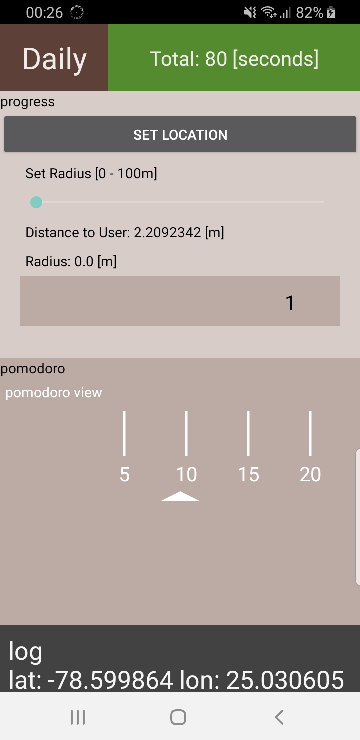

# Daily
* a simple app to support work
* work/learn in progress

## uses cases
* location (Green Zone)
    * set a reference location: button 'set location'
    * set radius (from 0 to 100m) for being in green zone (working area)
    * location icon will indicate a successful GPS connection
* pomodoro: 25 min task option and visual proceed
    * set timer from 5 to 25min [5min steps]
    * start pomodoro
    * TODO: notification for pomodoro end
    * receive 'points' for pomodoro task completion
* TODO: manual time edit
    * TODO: list times recorded
    * TODO: edit times

## version 0.0.3: screenshot

## version 0.0.2: screenshot

## version 0.0.1: screenshot

